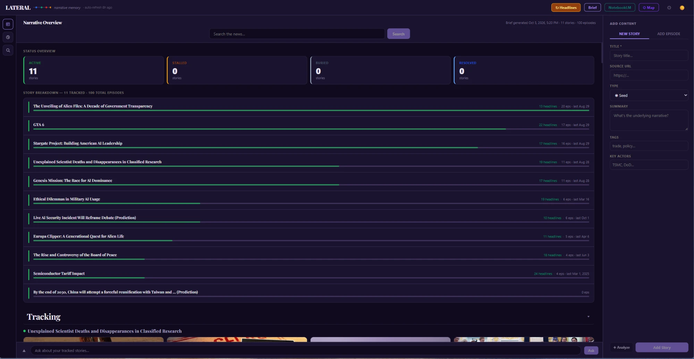
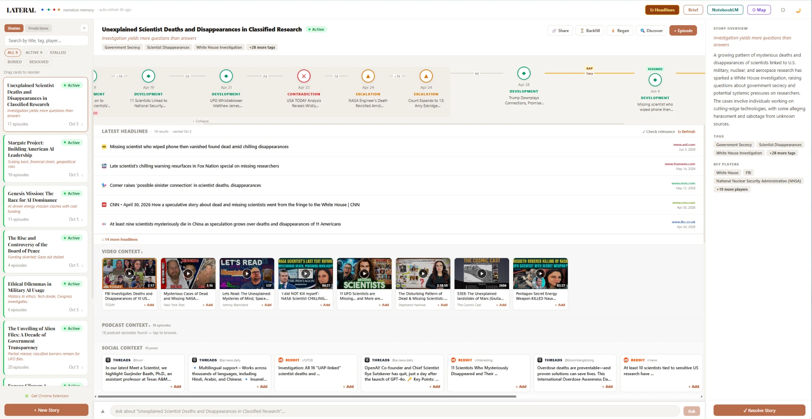
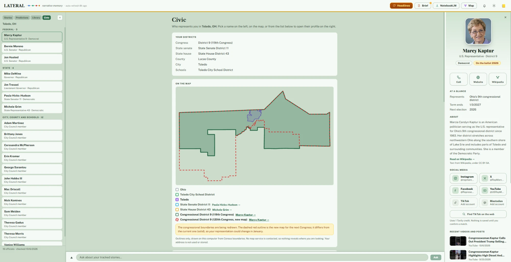

# Lateral — narrative memory

## Why

News is built to be forgotten. Each story arrives as if it had no past: a headline, a burst of coverage, then the next thing. Months later you remember that something happened (a lawsuit, a recall, a promise from someone in power) but not how it ended, or whether it ended at all.

Feeds don't help. They rank what's new, not what's unfinished. Search finds articles, not arcs.

Lateral is for the stories you don't want to lose track of. You tell it what you're following, and it keeps the timeline, gathers new coverage, tells you when something moves, and saves readable copies so the record survives dead links. When you think you know where a story is heading, you can write that down as a prediction and watch the evidence build for or against it, then keep score of how often you were right.

It runs on your own machine. Your stories, notes and predictions stay there.

Lateral is a local-first tool for following stories that unfold over months. You track a story, and Lateral keeps its timeline,
gathers fresh coverage, shows you what changed, and lets you test predictions against the evidence as it arrives.

It is a single-page app (`index.html`) plus a small Node server. It runs on your own machine and uses [Ollama](https://ollama.com)
for the AI parts; cloud LLM providers are optional.

## Screenshots



*The home overview (Midnight theme): every tracked story at a glance, with the latest coverage for each below. Lateral has three themes (Beige, Ledger and Midnight); pick one in Settings → Basic, or press `t` to cycle.*



*A story page: the episode timeline, the latest headlines (with the relevance filter's **Check relevance** button), and video, podcast and social context.*



*Civic: who represents you, with a district map and a full profile for each official. See [Civic](#civic-who-represents-you).*

## Features

- **Story timelines** — episodes, headlines, video and podcast context, intelligence briefs, a connection map, and shareable pages.
- **Discovery** — a home feed by category, plus a per-story "Discover" search with AI-generated queries.
- **Relevance filter** — keyword search drags in junk ("military duty" in a football story). A local model reads each article
  against the topic it was filed under and moves off-topic ones into a **Filtered out** list you can review and restore.
  Nothing is silently deleted.
- **Predictions** — write a falsifiable claim, attach *signals* (searches that watch for evidence), and Lateral finds articles and
  scores each as supporting, contradicting, complicating, or irrelevant. You can override any call. The **evidence balance** shows
  which way the news leans; it is *not* a probability and it never changes your own confidence.
- **Change alerts** — Lateral tells you when something you follow has moved. The **Activity** inbox (the bell, or press `a`) lists
  what it noticed: a prediction's evidence changing direction or shifting meaningfully, a resolution date getting close, a story
  picking up new coverage, setup problems, and Tavily credits running low. In **Settings → Alerts**, add [ntfy](https://ntfy.sh)
  (phone push), Discord, Slack, email (any SMTP server) or any webhook to get the important ones instantly and everything else as a daily digest, even
  with the app closed. **Quiet hours** hold instant alerts overnight (still listed in Activity) and send them afterwards as one message,
  optionally letting the important ones through; **Mute this story** under any update in Activity silences one story for a day, a week or
  until you unmute it (its updates stay in Activity, dimmed, but are never sent or put in the digest). Optionally let Lateral re-run your predictions' searches on a schedule so evidence keeps moving while you
  are away (it shows the Tavily credit cost first, and pauses at 90%).
- **RSS and Atom, both ways** — *Out:* **Settings → Feeds** gives you Atom feeds for any feed reader: everything on your Activity list,
  all your stories, a quiet **prediction flips** feed (one item each time a prediction's evidence changes direction), or one story (for a
  prediction: its evidence and movements, or just its moves with flips marked), plus an OPML file to subscribe to all of them at
  once. A secret in each address is the only password, and you can reset it. *In:* open a story, choose **Feeds** in the Latest
  Headlines bar, and paste a site or feed address (the feed is found for you) or import an OPML file. New items from those feeds
  join the story's headlines and its alerts, and are read on the background refresh too.
- **Same-story grouping** — one announcement carried by BBC, Axios, CBS and Bloomberg is one piece of evidence, not four. Lateral finds
  candidate duplicates (headline wording, plus embeddings if available) and has the local model judge each pair, then counts a group
  of articles once in a prediction's evidence balance. Repeats stay listed, dimmed and marked, and **Not the same story** puts one
  back. It leans cautious: when in doubt articles stay separate. The same grouping tidies your reading lists: in a story's **Latest
  Headlines** and across the **Home** feed, one story reported by several outlets shows once with **+N outlets** (or **Also covered by…**) that
  opens the other links, and the prediction side panel counts a repeated story once.
- **Saved copies and a Library** — Lateral keeps a readable text copy of the articles you track (new episodes, and evidence found
  for predictions), so timelines survive dead links. Open the **Library** tab in the left panel (or press `l`) to browse and search
  the full text of everything saved; each article opens in the main panel and is linked to the tracked story or prediction it came
  from (you can relink it, or filter the list by story). **Save & link everything I already track** catches up on what you had
  before. Copies stay on your computer; turn the automatic saving off in Settings → Basic.
- **Track record** — when a prediction settles, record whether it happened. Lateral keeps score of whether the evidence balance
  leaned the right way (only clear leans count) and whether your own confidence was on the right side, with a Brier score. Treat it
  as an anecdote until you have ten or more.
- **Setup check and backups** — **Settings → Status** shows whether Ollama, your models, Tavily and news search are working, with the
  fix next to anything that isn't. The same screen exports your data to one file and restores it. API keys are never included.
- **Civic** — who represents you, at every level of government, from one address that is never saved: a district map, a full profile for each official, and optional watches that turn bills, council business and federal rules into stories, with a one-click way to follow a bill as a prediction. [Details below.](#civic-who-represents-you)
- **Podcast key moments** — Podcast Context no longer just lists search hits. A local model scores every episode against your story
  (strong match, related, loose link, likely off-topic), orders them, and tucks weak ones away; **Not relevant** hides one for that
  story. **Transcribe** turns an episode into a searchable, timestamped transcript on your own computer (Whisper), and **Key moments**
  finds the passages that are actually about the story so you can play from there. [Details below.](#podcasts-ranking-transcripts-and-key-moments)
- **Export** — the **Export** button in the top bar gets your stories out of Lateral in three ways: a print-ready **PDF**
  (timelines and prediction evidence; the format NotebookLM, email and sharing accept), a single **Markdown** file, or an **Obsidian
  vault** (a .zip of linked notes: one per story, saved article and podcast, with frontmatter, tags and `[[wikilinks]]` between them
  and between related stories). For Markdown and the vault you can add the saved article text, podcast key moments and full
  transcripts, and the rest of your Library. Everything is built on your computer. [Details below.](#export)
- **Keyboard shortcuts** — `/` search, `h` home, `n` new story, `p` new prediction, `l` library, `c` civic, `a` activity, `,` settings, `t` theme, `?` for the list.
- **Article images that actually load** — many news results arrive as opaque Google News links. Lateral resolves them to the real
  article, reads the page, recovers bot-blocked pages with Tavily, and runs every candidate past a small vision model so logos,
  tiny thumbnails and unrelated images are rejected. Anything left shows a clean fallback card.

## Civic: who represents you

Open the **Civic** tab in the left panel (or press `c`) and enter one street address. Lateral finds your congressional, state senate
and state house districts, your school district and the people who hold those seats, with email, phone and website wherever a free
public source has them. Seats up for election this year are flagged, and if a new congressional map changes your district you are told.

**It needs no accounts and no API keys.** Everything starts from free public data: the U.S. Census Bureau, the public-domain
`congress-legislators` and `openstates/people` datasets, Legistar, Wikidata and Wikipedia. Your address goes only to the Census
Bureau and is **never saved**; Lateral keeps just the district numbers and your city and state, and you can remove them any time.

### The people

- **A profile in the right-hand column** for anyone you pick (from the list, the map or the overview): portrait, quick actions (email,
  call, website, Wikipedia), what they represent and their **term** (when it began and ends, where the source says, with a flag when it ends within a year), a short Wikipedia summary, social accounts, recent videos
  and contact details. Their district lights up on the map. Portraits come from the Congress photo sets, the legislature's own
  headshot or Wikipedia, and are fetched and cached by Lateral itself, so your browser never contacts those sites.
- **Social accounts** (Instagram, X, Facebook, YouTube, Mastodon) from the public datasets, with the recent YouTube and Mastodon
  posts shown. Add any account by hand. For accounts the datasets lack (TikTok especially) an opt-in web search proposes matches,
  says which have the person's name in the handle, and saves nothing until you confirm. It uses Tavily credits and the page says
  how many first.
- **A district map** of your congressional, state senate, state house, school-district and city outlines, plus the new congressional
  map when it differs. It is drawn on your computer from Census boundaries, with no map service contacted.
- **Other local offices.** Your **city council** is read from Legistar when your city uses it. Your **mayor** is read from Wikidata
  automatically (volunteers edit it, so it can lag an election, and the profile says so). The **county** (commissioners or
  executive), **county judges**, **sheriff** and **school board** have no single free list that covers every place, so each has a
  **Find with a web search** button (one Tavily credit; the page says so first). It asks a plain question, shows the answer and its
  sources, and lists the names it found. A name is offered only if it appears in the results, and nothing is saved until you tick it.
  Anyone can also be added by hand. Every person says where they came from, and a mayor you remove is not put back by a refresh.
  Two more searchable offices cover places that have them: a **city manager or administrator**, and the **other county officers**
  (auditor, treasurer, clerk, recorder, prosecutor, coroner, engineer), where each person keeps the office the source gives.
- **Term dates.** Congress shows the term's start and end and the election year. State legislators show when their current term
  began (Open States dates the role, and lists an end only when it has one). Council and board members read from Legistar show their
  listed term, and the mayor shows when they took office. A term ending within the next year is flagged.

### Boards and agendas

A county board, a school board, or a city that publishes its meetings somewhere other than Legistar has no one national source, so
you point Lateral at it. On the Civic page, **Boards and agendas** accepts three kinds of address:

- **Legistar** (`yourcounty.legistar.com`): upcoming meetings and legislation, and, for a county or school board, its members with
  their terms, listed in your profile like any other official. If your county has a Legistar site, Lateral finds it by name and
  offers it with one click; nothing is added until you say so.
- **Granicus** (`yourcity.granicus.com/ViewPublisher.php?view_id=…`): the meeting list a city publishes, with agenda and minutes links
  and tomorrow's meetings flagged. Site names cannot be guessed, so paste the address of the page that lists the meetings.
- **A feed or a website**: paste a district's or county's website and Lateral looks for its news or agenda feed (RSS or Atom), or
  paste the feed itself. Many school districts publish one.

**Look** shows what an address would give you (its name and a few real items) before you add anything. Each board you add can then be
switched on under **Watching** (a story that follows its meetings and new items, with a reminder the day before a meeting). Boards
belong to the place in your profile, so a new address starts without the old ones. BoardDocs and similar portals have no public feed
and cannot be read.

### Watching

On the Civic page, switch on what you want to follow: your **city council's** new legislation and upcoming meetings (Legistar, no
key), your **delegation's bills** in Congress (works without a key on a shared demo key limited to about 10 requests an hour; a
free Congress.gov key removes the limit), your **state legislators' bills** (needs a free Open States key), and **federal rules** on
topics you choose (Federal Register, no key, with public-comment deadlines). Each switch creates an ordinary story that the
background refresh keeps up to date; nothing is created until you press **Watch**, and **Stop** leaves the story in your list.
Alerts tell you when a bill or ordinance moves (passed, signed, enacted), when a meeting is tomorrow and when a comment period is
about to close; everything else goes in the daily digest. Keys are set up on the same page with a short walk-through, kept on your
computer and never exported.

### Follow a bill as a prediction

Hover any bill or city ordinance in a watch and press **Predict**. Lateral reads the bill's official record (Congress.gov, Open
States or the council's Legistar), asks what you are predicting (that it becomes law, passes the chamber it started in, or is
adopted), suggests a starting confidence from how bills like it usually go (a few percent for a newly introduced bill in Congress,
much higher once a chamber has passed it) and creates an ordinary prediction.

- The bill's own actions (introduced, committee, floor votes with their tallies and a link to the roll call, signed) appear as a
  **timeline** on the prediction page. It is a record of what happened, not evidence, and never touches the evidence balance.
- When the record settles the question (it became law, the chamber voted it through, the council adopted or rejected it) the
  prediction is resolved from it and an alert says so. If the date passes with nothing happening it resolves **No**, but only after
  a successful look at the record, so an outage never counts as an answer. A prediction you settle yourself is never overruled.

### On a phone

The two side panels (the menu on the left, details on the right) never stack. Each has a Close bar, closes with a swipe toward its
edge or a tap on the dimmed page, and choosing someone in the Civic list swaps straight to their profile.

## Podcasts: ranking, transcripts and key moments

Open a story and choose **Podcast Context**. Search finds episodes from Apple Podcasts (and Podcast Index or Listen Notes if you
added keys); Lateral then does three more things.

**1. Ranking.** The local model reads each episode's title, show and description against your story and scores it 0–3. Episodes
come back best first, each with a label and a one-line reason; loose and off-topic ones sit behind **Show N less relevant**. If
nothing scores well, you still see everything. **Not relevant** hides an episode for that story only (restore it from the list
under the results). If the model is down you get the plain search order and nothing is hidden.

**2. Transcripts.** **Transcribe** downloads the episode's audio and turns it into text with
[faster-whisper](https://github.com/SYSTRAN/faster-whisper). This needs a small helper that runs on your computer, outside Docker,
because Whisper needs Python and the proxy container is deliberately minimal:

```bash
pip install faster-whisper
python tools/transcribe_worker.py            # http://127.0.0.1:3007, model small.en
```

Lateral's container reaches it at `http://host.docker.internal:3007`. Docker can only get there if the worker listens beyond
localhost, and the worker refuses to do that without a password, so give it a token and tell Lateral the same one:

```bash
LATERAL_WORKER_TOKEN=pick-a-long-secret python tools/transcribe_worker.py          # listens on 0.0.0.0
# in .env (or data/podcast-worker.json: {"url": "...", "token": "..."}):
LATERAL_TRANSCRIBE_TOKEN=pick-a-long-secret
```

On Windows, `tools/start-worker.ps1` starts it in the background and reads the token from `data/podcast-worker.json`; on macOS and
Linux use `tools/start-worker.sh`. The worker only fetches public http(s) audio (it refuses private and loopback addresses), takes
one episode at a time and keeps nothing: the audio is deleted when transcription ends. The default model is `small.en`
(English). It runs on the CPU, so it does not compete with Ollama for your GPU: on a 16-thread desktop CPU `small.en` handles about
14 minutes of audio per minute, and `base.en` about 50. Choose another model with `--model` (`tiny.en`, `base.en`, `medium.en`, or a
multilingual name such as `small`). Transcription only ever starts when you click **Transcribe**.

**3. Key moments.** For a transcribed episode, **✦ Key moments** reads the transcript in overlapping 90-second passages, has the
local model judge each against your story, keeps the ones that are really about it, merges neighbours, and lists them in the order
they happen with a one-line reason, the text, and **▶ time–time** to play from there (nothing is cut or re-encoded, so storage stays
small). **Copy quote** copies the passage with the show, episode and timestamp. The **Full transcript** tab is searchable, and the
line being played is highlighted. **Re-scan** repeats the analysis (results are cached per story). For long episodes Lateral judges
at most 30 passages: the best keyword matches plus a spread through the rest.

Transcripts live in `data/podcasts/` and are not part of the Settings → Status export (they are large; copy the folder to back it up).

## Export

Press **Export** in the top bar. Choose the stories, the format, and what to include.

| Format | What you get |
|---|---|
| **PDF** | Opens a print-ready page in a new tab; press *Download PDF* there. Each story's timeline, and for predictions the claim, the evidence balance and every scored article. |
| **Markdown file** | One `.md` file: a section per story (summary, status, timeline with source links, prediction evidence). Plain enough for NotebookLM, other AI tools and any notes app. |
| **Obsidian vault** | A `.zip` with `Lateral/Stories`, `Articles`, `Podcasts` and `Library` folders and an index note. Each note has YAML frontmatter (title, type, status, dates, tags, actors) and links to the notes it relates to. Unzip it into your vault. |

For Markdown and the vault you can also include: **saved article text** (what Lateral saved for articles linked to those stories),
**the rest of my Library**, **podcast key moments** (the passages about each story, with timestamps, for episodes you
transcribed) and **full podcast transcripts**. Stories that share a person or two tags are linked as related. Your choices are
remembered. Nothing is sent anywhere: the files are assembled in your browser from your own data.

## Requirements

- **Docker** with Compose v2
- **Ollama** running on the host, with these models:
  ```bash
  ollama pull qwen3:latest     # relevance filter, evidence scoring, query generation, image-fit judge
  ollama pull moondream        # image judge (optional — without it images are accepted unjudged)
  ollama pull nomic-embed-text # same-story grouping (optional — without it grouping relies on headline wording)
  ```
- A **Tavily API key** (a free tier exists): <https://app.tavily.com>. It powers web search for evidence and briefs, and recovers
  images from pages that block scrapers.

## Quick start

```bash
git clone https://github.com/ragingapathy/lateral.git && cd lateral

# 1. Give SearXNG a private secret (any random string):
#    edit searxng/settings.yml  ->  server.secret_key

# 2. Optional: set keys through the environment (or paste them in the app instead)
cp .env.example .env

# 3. Start everything
docker compose up -d

# 4. Open the app:  http://localhost:8080
```

Then click the **⚙ Settings** icon → **Web search** → paste your Tavily key → **Save key**. Lateral runs a test search straight
away so you know the key works. The app opens with a fictional sample story so you can see how things look; delete it whenever.

## How the pieces fit

| Service | What it does |
|---|---|
| `web` (Caddy) | Serves `index.html` and forwards `/api/lateral/*` and `/v2/*` to the proxy, and `/ollama/*` to Ollama on the host. |
| `lateral-proxy` (Node) | News search, the predictions API, the relevance and image pipelines, saved settings, LLM passthrough. Code in `proxy/`. |
| `searxng` | Meta-search used for news results (JSON output enabled in `searxng/settings.yml`). |

## Your data

Everything that belongs to your install lives in `./data` (mounted into the proxy container at `/data`). It starts empty, is created
as you use the app, and is **git-ignored** — only `.gitkeep` and `llm-secrets.example.json` are tracked.

| File | What it holds |
|---|---|
| `llm-secrets.json` | API keys you save from Settings (Tavily, optional LLM providers, podcast services). **Secret.** |
| `stories.json` | The stories you track and their episodes. |
| `v2.json` | Predictions, their signals, and the articles scored against them. |
| `cache.json` | Cached headlines, discovery feed and briefs. Safe to delete; it rebuilds. |
| `settings.json` | Preferences such as location and refresh interval. |
| `relevance-cache.json` | AI relevance verdicts (what was filtered out of a topic and why), plus any you restored. |
| `alerts.json` | Alert settings (including your delivery-channel addresses and any email password, so **treat it as secret**), the Activity inbox, and what has already been reported. Not part of the Settings → Status export. |
| `feeds.json` | The secret that protects your outgoing feeds, and the feeds you follow for each story. **Secret.** Not part of the Settings → Status export. |
| `podcasts/` | Podcast transcripts (one JSON file each), the episode ranking cache, key-moment results, and which episodes you marked not relevant. Not part of the Settings → Status export; copy this folder to back it up. |
| `podcast-worker.json` | Optional address and token of the transcription helper (**secret**). Environment variables win over this file. |
| `archive/` | Saved copies of articles (one JSON file each, plus `index.json`). Not part of the Settings → Status export; copy this folder to back it up. |
| `civic-track.json` | The bills you follow as predictions: which bill each prediction tracks, what would settle it, and the official actions seen so far. Not part of the Settings → Status export. |
| `civic-boards.json` | The boards you added under Boards and agendas (Legistar, Granicus or feed addresses), and suggestions you dismissed. Not part of the Settings → Status export. |
| `civic-watch.json` | Which story each Civic watch feeds, your Federal Register topics, any optional Congress.gov / Open States keys (**secret**), and what has already been reported. Not part of the Settings → Status export. |
| `civic.json`, `civic-cache/` | Your Civic profile (district numbers, city and state, and the officials found; never your street address), and cached public datasets. The profile shows roughly where you live, so it is not part of the Settings → Status export; it takes seconds to recreate. |
| `image-cache.json`, `image-stats.json` | Resolved article image URLs, and pipeline counters including Tavily Extract usage. |
| `intelligence.log`, `refresh-log.json`, `purged-ids.json` | Operational logs and bookkeeping. |

To back up, copy the folder. To start fresh, stop the stack and empty it (keep `.gitkeep` in a git checkout).

## Configuration

Set on the `lateral-proxy` service in `docker-compose.yml`:

| Variable | Default | Purpose |
|---|---|---|
| `OLLAMA_BASE_URL` | `http://host.docker.internal:11434` | Where the proxy reaches Ollama. |
| `SEARXNG_URL` | `http://searxng:8080` | News search backend. |
| `TAVILY_API_KEY` | — | Optional; a key saved in Settings takes priority. |
| `LATERAL_SCORING_MODEL` | `qwen3:latest` | Evidence scoring. |
| `LATERAL_RELEVANCE_MODEL` | `qwen3:latest` | Relevance judge. |
| `LATERAL_VISION_MODEL` | `moondream:latest` | Describes candidate images. |
| `LATERAL_DEDUPE_MODEL` | the relevance model | Judges whether two articles report the same story. |
| `LATERAL_EMBED_MODEL` | `nomic-embed-text` | Optional; proposes candidate duplicate pairs. |
| `LATERAL_IMAGE_JUDGE_MODEL` | `qwen3:latest` | Decides photo-vs-logo and headline fit. |
| `LATERAL_TAVILY_EXTRACT_PER_DAY` | `40` | Daily cap on Tavily Extract calls (used only for pages that block direct fetching). |
| `LATERAL_NEWS_ENGINES` | see `proxy/server.js` | Which SearXNG news engines to use. |
| `LATERAL_TRANSCRIBE_URL` | `http://host.docker.internal:3007` | Where the proxy reaches the optional transcription helper. |
| `LATERAL_TRANSCRIBE_TOKEN` | — | Password shared with the helper (`LATERAL_WORKER_TOKEN` on its side). |
| `LATERAL_DATA_DIR` | `/data` | Where state is stored inside the container. |

## Scripting and automation

The proxy exposes a plain JSON API, so scripts and other tools can drive Lateral without the UI.

| Endpoint | Purpose |
|---|---|
| `GET/POST /v2/predictions` | List or create predictions (`statement`, `confidence`, `resolutionDate`, `signals[]`). |
| `GET/PATCH/DELETE /v2/predictions/:id` | Read (with evidence balance), edit, or delete a prediction. |
| `POST /v2/predictions/:id/search` | Start the background search-and-score job; poll `GET /v2/predictions/:id/search/status`. |
| `POST /v2/signals/suggest` | Suggest search signals for a statement. |
| `GET /v2/links?predictionId=` | Articles linked to a prediction, with stance, weight and reasoning. |
| `POST /v2/links/:id/review` · `/score` | Override a stance by hand, or have the model score it again. |
| `POST /v2/items` | Add an article as evidence, optionally linked to a prediction with a stance. |
| `POST /api/lateral/relevance/check` · `/relevance/override` | Relevance judge, and "restore" overrides. |
| `POST /api/lateral/archive/save` · `/queue` · `/backfill` | Save an article's readable text now (`{"url": …}`), save several in the background, or queue everything already in your stories and predictions. |
| `GET /api/lateral/archive/search?q=` · `/list` · `/get?key=` · `/stats` | Full-text search of saved copies (quote a phrase to match it exactly), newest-first list, one saved article, counters. |
| `POST /v2/predictions/:id/group` · `POST /v2/links/:id/separate` | Run same-story grouping for a prediction in the background; or count one article on its own (`{"separate": true}`). Links in `GET /v2/links` carry a `group`, and the evidence reports `echoes` and `events`. |
| `GET /api/lateral/alerts/events` · `/unread` · `/status` | The Activity inbox, its unread count, and the engine's state. |
| `GET/POST /api/lateral/alerts/config` | Read or change alert settings: channels (ntfy, Discord, Slack, webhook, or `email` with `host`, `port`, `secure` = `starttls`/`tls`/`none`, `user`, `pass`, `from`, `to`), `quiet` (`enabled`, `from`, `to`, `allowImportant`, `tzOffsetMin`) and the rest. Secrets are masked on the way out. |
| `POST /api/lateral/alerts/mute` `{"storyId", "hours"?}` · `/unmute` | Silence one story for some hours (omit or 0 for until you unmute it), or lift it. |
| `GET /api/lateral/feed/<secret>/flips.xml` · `/prediction/<id>.xml` | Atom feed of every prediction flip, or of one prediction's moves (⚑ marks a change of direction). |
| `POST /api/lateral/alerts/test` · `/digest` · `/check` · `/watch` | Send a test message, build or send the digest (`{"preview":true}` to look), run every detector now, or run the prediction watcher now. |
| `GET /api/lateral/feed/<secret>/activity.xml` · `/stories.xml` · `/story/<id>.xml` · `/lateral.opml` | The Atom feeds and OPML file. The secret is shown in Settings → Feeds. |
| `POST /api/lateral/feeds/preview` · `/subs` · `/subs/remove` · `/fetch` · `/opml` | Find a feed from an address, follow or unfollow one for a story, read a story's feeds now, or import OPML. `GET /feeds/info` and `POST /feeds/token/reset` manage the secret. |
| `POST /api/lateral/dedupe/headlines` `{"articles":[{"url","title","source"?,"text"?}]}` · `GET /dedupe/stats` | Group a list of articles by story: returns `groups` (each a list of member URLs) from verdicts already judged, and starts judging new pairs in the background (`pending: true` means ask again shortly). |
| `POST /api/lateral/podcast/rank` · `/podcast/feedback` | Score and order episodes for a story (`{"storyId","topic","ctx","tags","episodes":[…]}` → items with `score` 0–3, `why`, `rank`, `hidden`); hide or restore one (`{"storyId","key","hidden"}`). |
| `POST /api/lateral/podcast/transcribe` · `/podcast/status` · `GET /podcast/job?key=` · `/podcast/worker` | Start a transcript (`{"audioUrl", …}`; the helper must be running), check many episodes by audio URL, follow one job, or check the helper. |
| `GET /api/lateral/podcast/transcript?key=` · `/podcast/list?storyId=` · `DELETE /podcast/item?key=` | Read a transcript (segments in seconds), list transcribed episodes, forget one. |
| `POST /api/lateral/podcast/sections` · `GET /podcast/sections?key=&topic=` | Start finding key moments (background job) and read its progress or cached result. |
| `GET /api/lateral/civic/profile` · `POST /civic/lookup` `{"address": …}` · `/civic/refresh` · `/civic/legistar` `{"url": …}` · `/civic/remove` | Read the Civic profile; build one from a street address (the address is not stored); re-check officials without an address; point at (or confirm) the city's Legistar site; delete the profile. |
| `GET /api/lateral/civic/watch/list` · `GET /civic/watch/items?kind=` | The watches available for your profile (`council`, `delegation`, `state`, `rules`), whether each is on, and key status; one watch's current items. |
| `GET /api/lateral/civic/track/preview?item=` · `GET /civic/track/get?predictionId=` · `GET /civic/track/list` | What following a bill would create (targets, resolution date, starting confidence, latest actions); the official record behind a tracked prediction; all tracked predictions. `item` is a watch item id such as `bill:119-HR-1`, `os:ocd-bill/…` or `matter:44496`. |
| `GET /api/lateral/civic/boards/list` · `POST /civic/boards/suggest` · `/boards/preview` `{"input"}` · `/boards/add` · `/boards/remove` `{"id"}` · `/boards/dismiss` | Boards and agendas: your boards; look for a county Legistar site (probes only, nothing added); see what a pasted address would give (`kind` `legistar`, `granicus` or `feed`, with a few items, or the feeds found on a page); add one (`{"kind":"legistar","slug"}`, `{"kind":"granicus","host","viewId"}` or `{"kind":"feed","url"}`, with `scope` of `county`, `school`, `city` or `other`); remove or dismiss one. Each board is also a watch with kind `board:<id>`. |
| `POST /api/lateral/civic/office/discover` · `/office/add` · `/office/remove` · `/office/restore` | Local offices beyond the council: search the web for a county or school office (`{"officeId":"sheriff"}`; one Tavily credit, nothing saved), save confirmed or hand-entered people (`{"officeId"|"office","people":[…]}`), remove one, or ask Wikidata for the mayor again. |
| `POST /api/lateral/civic/track/start` · `/refresh` · `/stop` | Create the prediction and begin following (`{"item","target":"law\|chamber\|adopt","confidence","resolveBy"}`), check the record now (at most every five minutes), or stop following. |
| `POST /api/lateral/civic/watch/link` · `/unlink` · `/topics` · `/key` · `/key/test` | Record which story backs a watch (`{"kind","storyId"}`), stop one, set the Federal Register topics, save or remove an optional key (`{"which":"congress"\|"openstates","key"}`), or check a saved key. |
| `GET /api/lateral/civic/photo?key=` · `GET /civic/about?key=` | One official's portrait (image bytes, cached by Lateral; 404 when there is none), and their short Wikipedia summary and link when a clear match exists. |
| `GET /api/lateral/civic/shapes` · `GET /civic/posts?key=` | District outlines as GeoJSON (and whether the new congressional map differs); recent YouTube and Mastodon posts for one official (`key` is the official's `level\|office\|name`). |
| `POST /api/lateral/civic/social/set` · `/remove` · `/discover` | Add an account by hand (`{"key","platform","handle"}`, a handle or a profile address), remove one you added, or web-search for missing ones (`{"key","platforms":["tiktok","instagram"]}`; 1 Tavily credit per platform, nothing saved until you set it). |
| `GET /v2/calibration` | Track record across resolved predictions. Set an outcome with `PATCH /v2/predictions/:id` and `{"outcome":"yes"}`, `"no"` or `null` to reopen. |
| `GET /api/lateral/health/check` | Setup check: Ollama, models, Tavily key, news search, data folder. |
| `GET /api/lateral/backup` · `POST /api/lateral/restore` | Export your data as one JSON bundle, or restore one (`{"bundle": …, "dryRun": true}` previews without writing). |
| `POST /api/lateral/images/resolve` · `GET /api/lateral/images/stats` | Image pipeline, and its counters. |

Optional local routes: a git-ignored `proxy/v2.local.js` may export `route(req, reqUrl, res, ctx)` to add private endpoints.

## Chrome extension

`extension/` is a small companion that clips the page you're reading into a new story or a new episode.

1. Open `chrome://extensions` and switch on **Developer mode**.
2. Click **Load unpacked** and choose the `extension/` folder (the one containing `manifest.json`).
3. Open the extension's settings and set your Lateral URL (default `http://localhost:8080`).

## Things to know

- **The evidence balance is a direction, not a probability.** It counts weighted supporting vs. contradicting articles; it knows
  nothing about base rates, time horizon, or whether several articles describe the same event.
- **Local models vary.** Scores and relevance calls can shift slightly between runs. Overrides and restores are always kept.
- **Google News link resolution** uses an undocumented Google endpoint. If it ever stops working, Lateral falls back to its older
  behaviour: nothing breaks, but more articles show the fallback card.
- **Tavily usage.** Search and scoring use Tavily Search. Tavily Extract is only used for pages that block direct fetching, and is
  capped per day. `GET /api/lateral/images/stats` shows the counters, including estimated Extract credits.
- **Privacy.** Everything runs locally. Outbound traffic is: your searches (through SearXNG's upstream engines and Tavily), fetching
  the article pages you track, and any cloud LLM provider *you* configure. Civic adds a few public services (the Census Bureau
  for your address, which is not saved; TIGERweb boundaries; the `congress-legislators` and `openstates/people` datasets; Legistar;
  Wikidata and Wikipedia; Congress.gov, Open States and the Federal Register for watches), always fetched by Lateral's server, never
  by your browser.
- **Civic data is only as current as its sources.** Datasets can lag an election or a resignation, Wikidata is volunteer-edited, and a
  web search can be wrong, which is why searched names always wait for your confirmation. Use **Re-check officials** from time to
  time, and treat anything important as worth confirming on the official site, which every profile links to.

## Troubleshooting

- **"Tavily API key not configured"** — add it under Settings → Web search.
- **AI features fail / "Ollama unreachable"** — confirm Ollama is running and the models above are pulled. On Linux you may need
  Ollama to listen on all interfaces (`OLLAMA_HOST=0.0.0.0`) so containers can reach it.
- **News search returns little** — individual SearXNG engines come and go; check `docker compose logs searxng`.
- **"Save a copy" says the site blocks automated readers** — some publishers refuse plain requests. Lateral then tries Tavily
  Extract (shared with the image pipeline's daily cap); if that also fails, the article simply isn't saved. Video, audio and
  social pages are never saved as articles.
- **"The transcription worker is not running"** — start `python tools/transcribe_worker.py` (see the Podcasts section). From Docker, give
  it a token and set `LATERAL_TRANSCRIBE_TOKEN` to the same value; check `GET /api/lateral/podcast/worker`. "Rejected the token" means the two
  values differ.
- **Podcast ranking says "relevance judge offline"** — Ollama did not answer, so episodes are in search order. Start Ollama and press Refresh.
- **Images missing** — check `moondream` is installed and look at `/api/lateral/images/stats`. Articles with no usable image get the
  fallback card by design.

## What's new

**v2.3 — Podcasts.** Podcast Context ranks episodes against your story and hides the weak ones, **Transcribe** makes a local,
timestamped, searchable transcript with Whisper, and **Key moments** finds the passages that are really about the story so you can
play from them. The NotebookLM button became **Export**: PDF, a Markdown file or an Obsidian vault, with saved articles and podcast transcripts optional. Civic gains **Boards and agendas** (county Legistar sites, Granicus cities and any feed, each watchable, with members and terms listed from Legistar), **term dates** for officials, and two more searchable offices (city manager, other county officers). Alerts gain **quiet hours**, **per-story mute**, an **email (SMTP) channel** and a **prediction flips** feed. Headline lists and the Home feed now fold repeats of one story into a single entry (**+N outlets**), and the
prediction side panel no longer counts a repeated story twice.

**v2.2 — Civic.** Who represents you, from one address that is never saved: officials at every level with a full profile column,
social accounts and recent videos, a local district map, your mayor, county, courts, sheriff and school board, watches for council
business, bills and federal rules, and one-click bill tracking that settles a prediction from the official record. Phone side panels
close with a Close bar, a swipe or a tap. Prediction pages no longer show the resolution date a day early.

**v2.1.** Change alerts and the Activity inbox, RSS and Atom in and out, same-story grouping, saved copies and the Library, and market
witnesses (Polymarket and Kalshi) on predictions.

**v2.0**

- Predictions with editable signals, background search-and-score with live progress, per-article overrides and re-scoring, an evidence
  balance, and share pages that include the tracked evidence.
- The relevance filter and its reviewable "Filtered out" lists (Home Discovery, story Headlines, Discover modal).
- The image pipeline: Google News link resolution, image validation, vision judging, Tavily Extract recovery, and a fallback card.
- Prediction outcomes with a track record, a Settings → Status setup check, data export/import, and keyboard shortcuts.
- A **Web search** tab in Settings to save and test the Tavily key.
- A standalone `docker-compose.yml` stack.

## License

Lateral is **source-available** under the [PolyForm Noncommercial License 1.0.0](https://polyformproject.org/licenses/noncommercial/1.0.0/).
You may use, modify and share it for personal, educational, research and other noncommercial purposes. Commercial use requires
separate permission from the copyright holder. See `LICENSE`.
